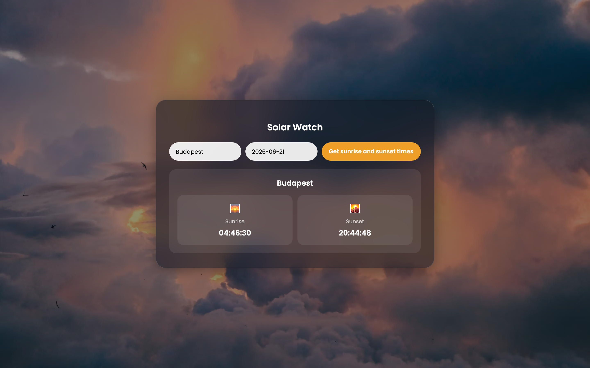
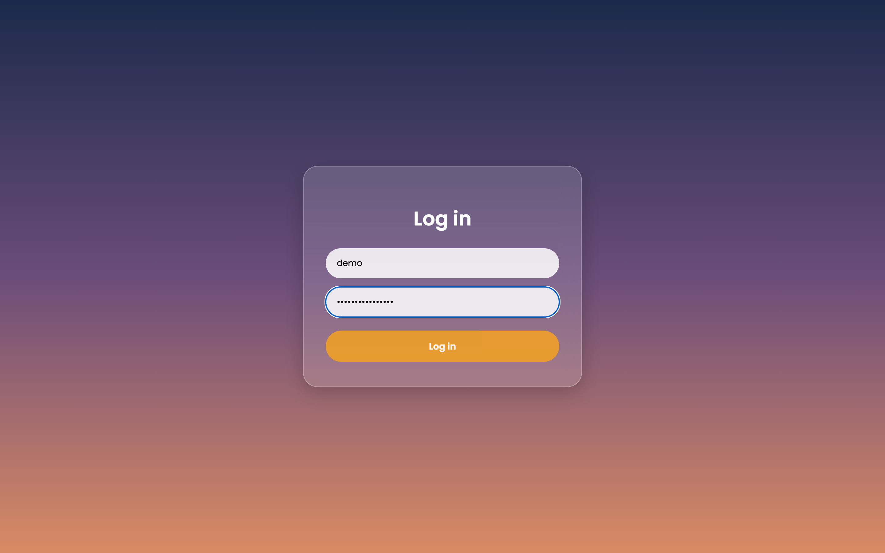
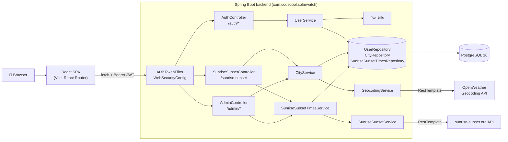

<div align="center">
  
  <h1>☀️ Solar Watch</h1>
  <p>Log in, type a city and a date, and find out when the sun rises and sets there.</p>

[](https://adoptium.net/temurin/releases/) [](https://spring.io/projects/spring-boot) [](https://react.dev) [](https://vite.dev)
[](https://www.postgresql.org/) [](https://www.docker.com/) [](https://jwt.io/)

[](https://github.com/CodecoolGlobal/solar-watch-mvp-java-telegdyluca/actions/workflows/maven.yml)

</div>

<details>
  <summary>Table of contents</summary>

- [About the project](#about-the-project) 
- [Built with](#built-with) 
- [Getting started](#getting-started) 
- [How it works](#how-it-works) 
- [API](#api) 
- [Configuration](#configuration) 
- [Tests](#tests) 
- [Roadmap](#roadmap) 
- [Contact](#contact)

</details>

## About the project



I built Solar Watch application as my Codecool MVP: a Spring Boot REST API with JWT auth, plus a small React app on top of it. You ask for a city and a date, and it answers with the sunrise and sunset times.

The backend doesn't come with a list of cities. The first time someone asks for one, it looks it up with the OpenWeather Geocoding API, takes the first match and saves it in PostgreSQL. Sun times work the same way: each city and date pair is fetched from sunrise-sunset.org once and stored, so the next time anyone asks, the answer comes straight from the database.

- You register and log in through `/auth/*`, and every other request carries `Authorization: Bearer <token>`.
- Passwords are hashed with BCrypt, and there are two roles, `ROLE_USER` and `ROLE_ADMIN`.
- On startup `AdminSeeder` creates a single `admin` user with `ROLE_ADMIN` if there isn't one yet, using `SOLARWATCH_ADMIN_PASSWORD`.
- The admin can create, edit and delete cities and sunrise/sunset records. There's no admin UI yet, so that part is API-only.
- The React app has three routes: `/registration` and `/login` for guests (`GuestsOnly`), and `/solar-watch` behind `Protected`. `AuthProvider` keeps the session (`{ jwt, username, roles }`) in `localStorage`.

## Built with

- [](https://adoptium.net/temurin/releases/) 
- [](https://spring.io/projects/spring-boot) 
- [](https://spring.io/projects/spring-security) 
- [](https://hibernate.org/)
- [](https://maven.apache.org/) 
- [](https://www.postgresql.org/) 
- [](https://jwt.io/) 
- [](https://react.dev)
- [](https://reactrouter.com/) 
- [](https://vite.dev) 
- [](https://www.docker.com/) 
- [](https://openweathermap.org/api/geocoding-api)
- [](https://sunrise-sunset.org/api)

Spring Boot 4.1.0 with Web MVC, Data JPA, Security and the RestClient starter. Maven 3.9.16 comes pinned through the wrapper in `backend/mvnw`, auth uses `jjwt` 0.13.0 with HMAC-signed tokens (no server-side session), and the frontend is styled with plain CSS.

## Getting started

### Prerequisites

- [](https://www.docker.com/products/docker-desktop/) runs the backend and the database, and it builds the Java part for you, so you don't need Java installed for that route. Install it, start it, and check with `docker --version`.
- [](https://nodejs.org/en/download) runs the React app, and npm comes with it. Vite 8 needs 20.19+ or 22.12+. Check with `node -v`.
- [](https://git-scm.com/downloads) downloads the code. Check with `git --version`.
- [](https://adoptium.net/temurin/releases/?version=17) is only for the no-Docker route. Check with `java -version`.

### Get the code

```bash
git clone https://github.com/CodecoolGlobal/solar-watch-mvp-java-telegdyluca.git
cd solar-watch-mvp-java-telegdyluca
```

### Configure

Both `.env` files are git-ignored, so you'll have to create them yourself. Compose reads the first one from the repo root and sets up the database connection and the JWT expiration on its own.

```dotenv
# .env in the repository root, fill in your own values
OPENWEATHER_API_KEY=<your-openweather-api-key>
SOLARWATCH_JWT_SECRET=<base64-encoded-256-bit-key>
SOLARWATCH_ADMIN_PASSWORD=<choose-an-admin-password>
```

```dotenv
# frontend/.env
VITE_API_BASE_URL=http://localhost:8080
```

- **OpenWeather key:** make a free account and copy a key from [home.openweathermap.org/api_keys](https://home.openweathermap.org/api_keys).
- **JWT secret:** run `openssl rand -base64 32` and paste the output. It has to be Base64 and at least 256 bits, which that command gives you.
- **Admin password:** anything you like. It's the password of the `admin` account.

### Run with Docker (recommended)

1. Start Docker Desktop and wait until it says it's running.
2. In the repo root, run `docker compose up --build`. That builds and starts the API on port `8080` and PostgreSQL on host port `5433`. The first build takes a few minutes. It's ready when the log shows `Started SolarWatchApplication`.
3. Compose doesn't start the frontend, so open a second terminal and run `cd frontend`, then `npm install`, then `npm run dev`.
4. Open **http://localhost:5173/registration**, create an account, and you'll be sent to **http://localhost:5173/login**.
5. Log in and you land on `/solar-watch`. Type a city, a date like `2026-06-21`, and click **Get sunrise and sunset times**. You should see the city with its sunrise and sunset.

To stop, press `Ctrl+C` in both terminals. The database lives in the `solarwatch-db-data` volume, so your cities and users survive a restart.

### Run without Docker

Start only the database with `docker compose up -d db`. It's exposed on `localhost:5433`, which is what the default `DB_URL` expects. Then export the backend variables with your own values and start the API:

```bash
export OPENWEATHER_API_KEY=<your-openweather-api-key>
export SOLARWATCH_JWT_SECRET=<base64-encoded-256-bit-key>
export SOLARWATCH_JWT_EXPIRATION=86400000
export SOLARWATCH_ADMIN_PASSWORD=<choose-an-admin-password>
export DB_USER=<db-user-from-compose.yaml>
export DB_PASSWORD=<db-password-from-compose.yaml>
cd backend
chmod +x mvnw        # the wrapper is committed without the executable bit
./mvnw spring-boot:run
```

And in another terminal, the frontend: `cd frontend`, `npm install`, `npm run dev`. Besides `dev`, `frontend/package.json` also has `build`, `preview` and `lint` scripts.

### Something not working?

- **Port 5433 or 8080 already in use:** another PostgreSQL or app is holding it. Stop it, or on the no-Docker route set `PORT` to move the API.
- **A variable isn't set:** without Docker the backend stops at startup with `Could not resolve placeholder`, so check your `export` lines. With Docker, compose warns that a variable `is not set` when the root `.env` is missing a value.
- **`Error: Get operation failed` after a search:** the date has to be typed as `yyyy-MM-dd`, for example `2026-06-21`.
- **Backend image fails to build on an Apple Silicon Mac:** `backend/Dockerfile` uses `eclipse-temurin:17-jre-alpine`, which has no arm64 build. Change that tag to `eclipse-temurin:17-jre` in your local copy and run `docker compose up --build` again.
- **Nothing useful at http://localhost:5173:** there's no `/` route. Go to `/login` or `/registration`.

## How it works



Every request goes through `AuthTokenFilter`, which checks the Bearer token with `JwtUtils`. For a sunrise/sunset query, `CityService` looks in the database first and only calls `GeocodingService` on a miss, and `SunriseSunsetTimesService` does the same with `SunriseSunsetService`. Hibernate manages the schema with `ddl-auto=update`. Errors are handled in `ControllerAdvice`: `CityNotFoundException` and `IllegalArgumentException` become `400`, and `AuthenticationException` or a missing token becomes `401`.

## API

| Method | Path | Auth | Purpose | Success |
|---|---|---|---|---|
| `POST` | `/auth/register` | Public | Register a user with `ROLE_USER` | `201` + `"User successfully created"` |
| `POST` | `/auth/login` | Public | Authenticate and receive a JWT | `200` + `JwtResponse` |
| `GET` | `/sunrise-sunset?city={name}&date={yyyy-MM-dd}` | Any logged-in user | Sunrise/sunset for a city and date | `200` + `SunriseSunsetReport` |
| `POST` | `/admin/city` | `ROLE_ADMIN` | Create a city (`CityRequest`) | `201` |
| `PUT` | `/admin/city/{id}` | `ROLE_ADMIN` | Update a city | `200` |
| `DELETE` | `/admin/city/{id}` | `ROLE_ADMIN` | Delete a city | `204` |
| `POST` | `/admin/sunrise-sunset` | `ROLE_ADMIN` | Create a sunrise/sunset record (`SunriseSunsetRequest`) | `201` |
| `PUT` | `/admin/sunrise-sunset/{id}` | `ROLE_ADMIN` | Update a sunrise/sunset record | `200` |
| `DELETE` | `/admin/sunrise-sunset/{id}` | `ROLE_ADMIN` | Delete a sunrise/sunset record | `204` |

An unknown city, a username that's already taken, or an id that doesn't exist gets a `400` with a plain-text message. Bad credentials and missing or invalid tokens get a `401`.

<details>
  <summary>Examples</summary>

Logging in, then asking for Budapest with the token you got back:
```http
POST /auth/login
Content-Type: application/json

{ "username": "alice", "password": "<password>" }
→ { "jwt": "<token>", "username": "alice", "roles": ["ROLE_USER"] }

GET /sunrise-sunset?city=Budapest&date=2026-06-21
Authorization: Bearer <token>
→ { "city": "Budapest", "date": "2026-06-21", "sunrise": "04:46:30", "sunset": "20:44:48" }
```

If you're calling the admin endpoints, a `CityRequest` and a `SunriseSunsetRequest` look like this:
```text
{ "name": "Budapest", "country": "HU", "state": "Budapest", "latitude": 47.4979, "longitude": 19.0402 }
{ "cityId": 1, "date": "2026-06-21", "sunrise": "04:46:30", "sunset": "20:44:48" }
```

</details>

## Configuration

The backend reads these environment variables through `backend/src/main/resources/application.properties`:

| Variable | Required | Default | Used for |
|---|---|---|---|
| `OPENWEATHER_API_KEY` | yes | none | OpenWeather Geocoding API key |
| `SOLARWATCH_JWT_SECRET` | yes | none | HMAC signing key for the tokens (`JwtUtils`). It has to be **Base64-encoded** and at least 256 bits, e.g. from `openssl rand -base64 32` |
| `SOLARWATCH_JWT_EXPIRATION` | yes | none | Token lifetime in milliseconds (`compose.yaml` uses `86400000`, i.e. 24 h) |
| `SOLARWATCH_ADMIN_PASSWORD` | yes | none | Password for the seeded `admin` user |
| `DB_USER` | yes | none | PostgreSQL username |
| `DB_PASSWORD` | yes | none | PostgreSQL password |
| `DB_URL` | | `jdbc:postgresql://localhost:5433/solarwatch?sslmode=disable` | JDBC URL |
| `PORT` | | `8080` | HTTP port |
| `CORS_ALLOWED_ORIGINS` | | `http://localhost:5173` | Allowed browser origins (comma-separated) |
| `SPRING_JPA_SHOW_SQL` | | `true` | Log SQL statements |

## Tests

Run them with `cd backend && ./mvnw test`. There are 8 test classes with 12 test methods: unit tests with JUnit 5 and Mockito, integration tests with `@SpringBootTest`, MockMvc and OkHttp MockWebServer standing in for the outside APIs, and one context-loads smoke test. They run under the `test` profile against an in-memory H2 database, but Spring still needs `SOLARWATCH_JWT_SECRET`, `SOLARWATCH_JWT_EXPIRATION` and `OPENWEATHER_API_KEY` exported to resolve its placeholders. The API URL templates are properties (`codecool.app.geourl` and `codecool.app.sunriseurl`) so the tests can point them at the mock server. CI (`.github/workflows/maven.yml`) runs `mvn -B package` on JDK 17 for pushes and pull requests to `main`, with the three variables coming from repository secrets.

## Contact

Telegdy Luca ([@telegdyluca](https://github.com/telegdyluca)), built as part of the Codecool curriculum. Project link: [github.com/CodecoolGlobal/solar-watch-mvp-java-telegdyluca](https://github.com/CodecoolGlobal/solar-watch-mvp-java-telegdyluca)
